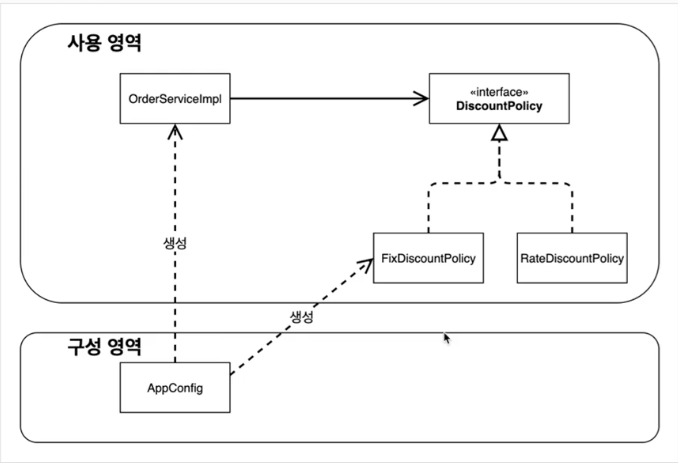
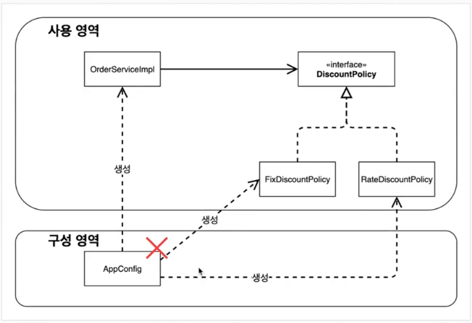

### 새로운 구조와 할인 정책 적용

- 처음으로 돌아가서 정액 할인 정책을 정률% 할인 정책으로 변경해보자.
- FixedDiscountPolicy -> RateDiscountPolicy
- 어떤 부분만 변경하면 되겠는가 ?
> AppConfig 의 등장으로 애플리케이션이 크게 사용 영역과, 객체를 구성하고 구성(Configuration) 하는 영역으로 분리되었다.



### 그림 - 할인 정책의 변경


- FixDiscountPolicy -> RateDiscountPolicy 로 변경해도 구성 영역만 영향을 받고, 사용 영역은 전혀 영향을 받지 않는다.

```java
public class AppConfig {

    public MemberService memberService() {
        return new MemberServiceImpl(memberRepository());
    }

    public OrderService orderService() {
        return new OrderServiceImpl(memberRepository(), discountPolicy());
    }

    /**
     * return 문 한곳만 바꾸면 된다 
     */
    public DiscountPolicy discountPolicy() {
        return new FixDiscountPolicy();
    }

    private MemberRepository memberRepository() {
        return new MemoryMemberRepository();
    }
}
```