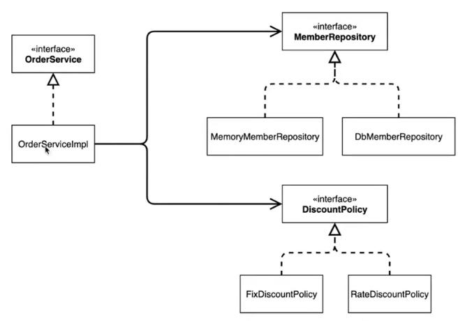

### IoC, Di 그리고 컨테이너

### 제어의 역전 (IoC) Inversion of Control
- 기존 프로그램은 클라이언트 구현 객체가 스스로 필요한 서버 구현 객체를 생성하고, 연결하고, 실행했다. 
한마디로 구현 객체가 프로그램의 제어 흐름을 스스로 조종했다. 개발자 입장에서는 자연스러운 흐름이다.
- 반면에 AppConfig 가 등장한 이후에 구현 객체는 자신의 로직을 실행하는 역할만 담당한다. 프로그램의 제어 흐름은 이제 AppConfig 가 생성한다.
그리고 AppConfig 는 OrderServiceImpl 이 아닌, OrderService 인터페이스의 다른 구현 객체를 생성하고 실행할 수 도 있다. 그런 사실도 모른체 OrderServiceImpl 은 묵묵히 자신의 로직을 실행할 뿐이다.
- 이렇듯 프로그램의 제어 흐름을 직접 제어하는 것이 아니라 외부에서 관리하는 것을 제어의 역전(IoC)이라 한다.

### 프레임워크 vs 라이브러리
- 프레임워크가 내가 작성한 코드를 제어하고, 대신 실행하면 그것은 프레임워크가 맞다. (Junit)
- 반면에, 내가 작성한 코드가 직접 제어의 흐름을 담당한다면, 그것은 프레임워크가 아니라 라이브러리다.

### 의존관계 주입 (DI) Dependency Injection
- OrderServiceImpl 은 DiscountPolicy 인터페이스에 의존한다. 실제 어떤 구햔 객체가 사용될지는 모른다.
- 의존관계는 *장적인 클레스 의존 관계와, 실행 시점에 결정되는 동적인 객체(인스턴스) 의존 관계* 둘을 분리해서 생각해야한다.

### *정적인 클래스 의존관계*
- 클래스가 사용하는 import 코드만 보고 의존관계를 쉽게 판단할 수 있다. 정적인 의존관계는 애플리케이션을 실행하지 않아도 분석할 수 있다.
- 클래스 다이어 그램을 보자.
- OrderServiceImpl 은 MemberRepository, DiscountPolicy 에 의존한다는 것을 알 수 있다.
- 그런데 이러한 클래스 의존관계 만으로는 실제 어떤 객체가 OrderServiceImpl 에 주입되는지는 알 수 없다.

### 클래스 다이어그램

### solid 원칙
- SRP : 단일 책임 원칙 (Single Responsibility Principle)
- OCP : 개방-폐쇄 원칙 (Open-Closed Principle)
- LSP : 리스코프 치환 원칙 (Liskov Substitution Principle)
  - 자식 클래스는 언제나 자신의 부모 클래스를 대체할 수 있어야 한다.
- ISP : 인터페이스 분리 원칙 (Interface Segregation Principle)
    - 인터페이스를 클라이언트에 특화되도록 분리해야 한다.
- DIP : 의존관계 역전 원칙 (Dependency Inversion Principle)
    - 의존관계 주입은 인터페이스를 통해서만 의존관계를 주입할 수 있다.