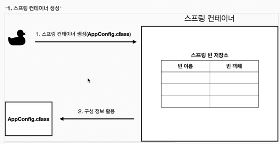
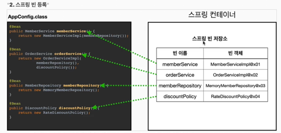

### 스프링 컨테이너
- ApplicationContext 를 스프링 컨테이너 라고 한다.
- 기존에는 개발자가 AppConfig 를 사용해서 직접 객체를 생성하고 DI 를 했지만, 이제부터는 스프링 컨테이너를 통해서 사용한다.
- 스프링 컨테이너는 @Configuration 이 붙은 AppConfig 를 설정(구성) 정보로 사용한다. 여기서 @Bean 이라 적힌 메서드를 모두 호출해서 반환된 객체를 스프링 컨테이너에 등록한다. 이렇게 스프링 컨테이너에 등록 된 객체를 스프링 빈이라 한다.
- 스프링 빈은 @Bean 이 붙은 메서드의 명을 스프링 빈의 이름으로 사용한다. memberService, orderService 
- 이전에는 개발자가 필요한 객체를 AppConfig 를 사용해서 직접 조회했지만, 이제부터는 스프링 컨테이너를 통해서 필요한 스프링 빈 (객체) 를 찾아야 한다. 스프링 빈은 ApplicationContext.getBean() 메서드를 사용해서 찾을 수 있다.
- 기존에는 개발자가 직접 자바코드로 모든 것을 했다면 이제부터는 스프링 컨테이너에 객체를 스프링 빈으로 등록하고, 스프링 컨테이너에서 스프링 빈을 찾아서 사용하도록 변경하였다.
- 코드가 약간 더 복잡해진 것 같은데, 스프링 컨테이너를 사용하면 어떤 장점이 있을까 ?
- xml 기반으로 만들 수도 있고, 에노테이션 기반으로 만들 수 도 있다.
- 직전에 AppConfig 를 사용했던 방식이 에노테이션 기반으로 스프링 컨테이너를 만든것.

> 참고: 더 정확히는 스프링 컨테이너를 부를 때 BeanFactory, ApplicationContext 로 구분해서 이야기 한다. 이 부분은 뒤에서 보완.
> BeanFactory 를 직접 사용하는 경우는 거의 없으므로 일반적으로 ApplicationContext 를 스프링 컨테이너라고 한다.

1. new AnnotationConfigApplicationContext(AppConfig.class) 를 통해서 스프링 컨테이너를 생성한다.
2. 스프링 컨테이너를 생성할 때는 구성 정보를 지정해 주어야 한다.
3. 여기서는 AppConfig.class 를 구성 정보로 지정했다.

- 스프링 컨테이너는 @Bean 이 붙은 메서드를 모두 호출해서 반환된 객체를 스프링 빈으로 등록한다.

### 빈 이름
- 빈 이름은 메서드 이름을 사용한다.
