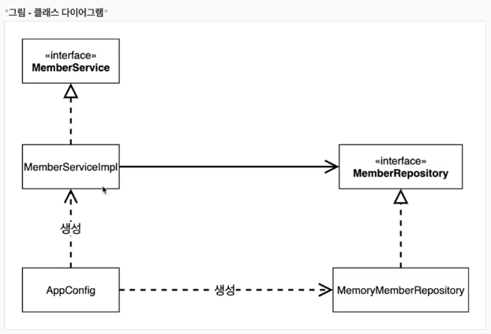
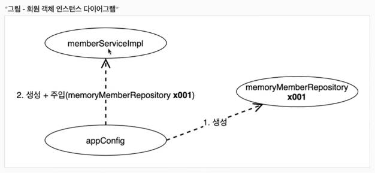

### 관심사의 분리
- 관심사의 분리는 객체지향 설계의 핵심이다 .
- 배우는 본인의 역할인 배역을 수행하는 것에만 집중해야 한다.
- 공연을 구성하고, 담당하는 배우를 섭외하고, 열학에 맞는 배우를 지정하는 책임을 담당하는 별도의 공연 기획자가 나올 시점이다.
- 공연 기획자를 만들고, 배우와 공연 기획자의 책임을 확실히 분리하자.

### AppConfig 등장
- AppConfig 는 애플리케이션의 실제 동작에 필요한 구현 객체를 생성한다.
- 구현객체를 생성하고 별도로 설정하는 역할을 만들어 보자.

### AppConfig 는 애플리케이션의 실제 동작에 필요한 구현 객체를 생성 한다.
- MemberServiceImpl
- MemoryMemberRepository
- OrderServiceImpl
- FixDiscountPolicy

### AppConfig 는 생성한 객체 인스턴스의 참조(레퍼런스) 를 생성자를 통해서 주입(연결) 해준다
- MemberServiceImpl -> MemoryMemberRepository
- OrderServiceImpl -> MemoryMemberRepository, FixDiscountPolicy

> 참고. 지금은 각 클래스에 생성자가 없어서 컴파일 오류가 발생한다. 바로 다음에 코드에서 생성자를 만든다.

- 객체의 생성과 연결은 AppConfig 가 담당한다.
- DIP 완성: MemberServiceImpl, MemberRepository 인 추상에만 의존하면 된다. 이제 구체 클래스를 몰라도 된다.
- 관심사의 분리: 객체를 생성하고 연결하는 역할과 실행하는 역할이 명확히 분리되었다.

### 그림 - 회원 객체 인스턴스 다이어그램

- appConfig 객체는 memoryMemberRepository 객체를 생성하고, 그 참조값을 memberServiceImpl 을 생성하면서 생성자로 전달한다.
- 클라이언트인 memberServiceImpl 입장에서 보면 의존관계를 마치 외부에서 주입해주는 것 같다고 해서 DI(Dependency Injection) 우리말로 의존관계 주입 또는 의존성 주입이라 한다.

- 설계 변경으로 OrderServiceImpl 은 FixDiscountPolicy 를 의존하지 않는다!
- 단지 DiscountPolicy 인터페이스만 의존하면 된다.
- OrderServiceImpl 입장에서 생성자를 통해 어떤 구현 객체가 들어올지(주입 될지) 는 알 수 없다.
- OrderServiceImpl 의 생성자를 통해서 어떤 구현 객체를 주입할지는 오직 외부(AppConfig) 에서 결정한다.
- OrderServiceImpl 이제부터 실행에만 집중하면 된다.

