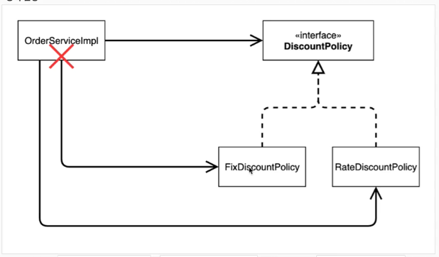
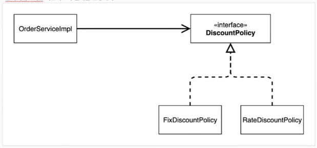
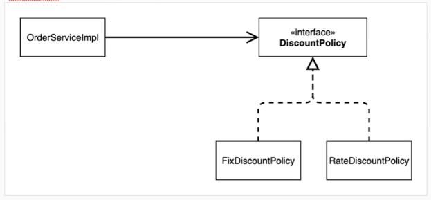

### 문제점 발견
- 우리의 역할과 구현을 충실하게 분리했다. -> OK
- 다형성도 활용하고, 인터페이스와 구현 객체를 분리했다. -> OK
- OCP, DIP 같은 객체지향 설계 원칙을 충실히 준수했다
    - 그렇게 보이지만 사실은 아니다.
- DIP: 주문서비스 클라이언트(OrderServiceImpl) 는 DiscountPolicy 인터페이스에 의존하면서 DIP 를 지킨것 같은데?
  - 클래스 의존관계를 분석해 보자. 추상(인터페이스) 뿐만 아니라 구체(구현) 클래스에도 의존하고 있다.
    - 추상(인터페이스에 의존) DiscountPolicy
    - 구체(구현) 클래스: FixDiscountPolicy, RateDiscountPolicy
- OCP: 변경하지 않고 확장할 수 있다고 했는데!
  - 지금 코드는 기능을 확장해서 변경하면, 클라이언트 코드에 영향을 준다! 따라서 OCP 를 위반한다.

### 왜 클라이언트 코드를 변경해야 할까?
클래스 다이어그램으로 의존관계를 분석해보자

### 지금 보니 정책을 변경함에 따라서, FixDiscountPolicy, RateDiscountPolicy 를 변경하는 순간 OrderServiceImpl 의 소스 코드도 함께 변경해야 한다! 
- 이는 OCP 를 위반한다. ( 기름차에서 전기차로 바꾸어서 운전하려면, 기름차의 엔진을 전기차 엔진으로 변경해야 한다. ) 극단적으로 가면, 라이센스를 새로 갱신해야 되는샘


### 해결책
- 클라이언트 코드를 변경하지 않고, 정책을 변경할 수 있도록 설계를 변경해보자

### 어떻게 문제를 해결할 수 있을까 ?
- 클라이언트 코드인 OrderServiceImpl 은 DiscountPolicy 의 인터페이스 뿐만 아니라 구체 클래스도 함께 의존한다.
- 그래서 구체 클래스를 변경할 때 클라이언트 코드도 함께 변경해야 한다.
- DIP 위반 -> 추상에만 의존하도록 변경(인터페이스에만 의존)
- DIP 를 위반 하지 않도록 인터페이스에만 의존하도록 의존관계를 변경하면 된다.

### 인터페이스에만 의존하도록 설계를 변경


### AS-IS 
```java
public class OrderServiceImpl implements OrderService {

    private final MemberRepository memberRepository = new MemoryMemberRepository();
    private final DiscountPolicy discountPolicy = new FixDiscountPolicy();

    @Override
    public Order createOrder(final Long memberId, final String itemName, final int itemPrice) {
        Member member = memberRepository.findById(memberId);
        int discountPrice = discountPolicy.discount(member, itemPrice);

        return new Order(memberId, itemName, itemPrice, discountPrice);
    }
}
```
### TO-BE

```java
public class OrderServiceImpl implements OrderService {

    private final MemberRepository memberRepository = new MemoryMemberRepository();
    private final DiscountPolicy discountPolicy;

    @Override
    public Order createOrder(final Long memberId, final String itemName, final int itemPrice) {
        Member member = memberRepository.findById(memberId);
        int discountPrice = discountPolicy.discount(member, itemPrice);

        return new Order(memberId, itemName, itemPrice, discountPrice);
    }
}
```

- 인터페이스에만 의존하도록 변경했지만, 클라이언트 코드인 OrderServiceImpl 은 구체 클래스를 직접 선택하고 생성하고 있다.
- 이는 NPE 가 발생한다 ( NullPointException = null 에다 . (점) 찍으면 NPE 쥐...)
- 이 문제를 해결하려면, 누군가가 클라이언트인 OrderServiceImpl 에 DiscountPolicy 의 구현 객체를 대신 생성하고 주입해 주어야 한다.

### OrderServiceImpl 의 생성자를 통해서 DiscountPolicy 의 구현 객체를 주입 받도록 변경해야 한다.


