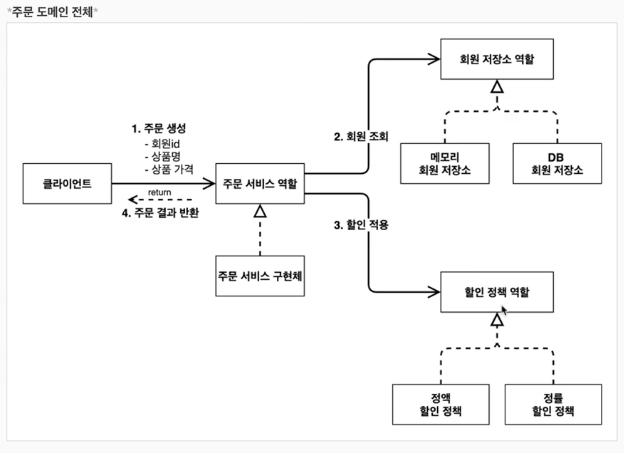
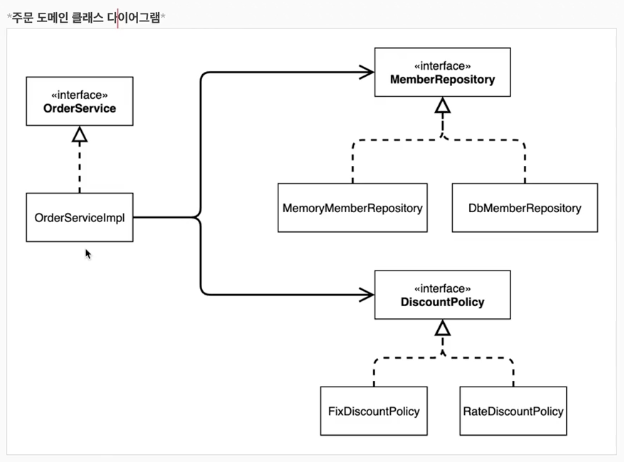
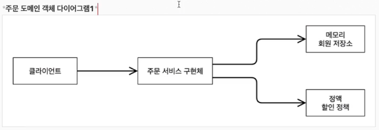
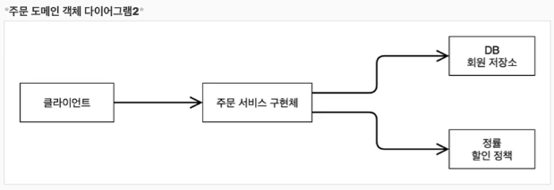

### 주문과 할인 정책

- 주문과 할인정책
  - 회원은 상품을 주문 할 수 있다.
  - 회원 등급에 따라 할인 정책을 적용 할 수 있다.
  - 할인 정책은 모든 VIP 에 1000원을 할인해주는 고정 금액 할인을 적용해달라. (나중에 변경 고려)
  - 할인 정책은 변경 가능성이 높다. 회사의 기본 할인 정책을 아직 정하지 못했고, 오픈 직전까지 고민을 미루고 싶다. 
    - 최악의 경우 할인을 적용하지 않을 수 도 있다. (미확정) 

### 주문 도메인 협력, 역할 책임

1. 주문 생성: 클라이언트는 주문서비스에 주문 생성을 요청한다.
2. 회원 조회: 할인을 위해서는 회원 등급이 필요하다. 그래서 주문 서비스는 회원 저장소에서 회원을 조회한다.
3. 할인 적용: 주문 서비스는 회원 등급에 따른 할인 여부를 할인 정책에 위임한다.
4. 주문 결과 반환: 주문 서비스는 할인 결과를 포함한 주문 결과를 반환한다.

### 주문 도메인 전체

### 주문 클래스 다이어그램

### 주문 도메인 객체 다이어그램

### 주문 도메인 객체 다이어그램2

