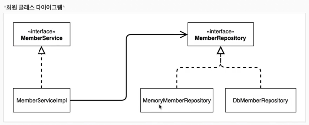
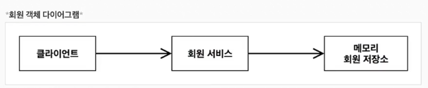

### 회원 도메인 협력 관계

- 회원 도메인 요구사항
    - 회원을 가입하고 조회할 수 있다.
    - 회원은 일반과 VIP 두가지 등급이 있다.
    - 회원 데이터는 자체 DB 를 구축할 수 있고, 외부 시스템과 연동 될 수 있다.

- 회원 도메인 협력 관계
    - 회원은 자체 DB 에 저장하거나, 외부 시스템과 연동하여 저장할 수 있다.
    - 회원 등급 정책은 변경 가능성이 높다.
    - 회원 등급 정책 변경 시 회원 도메인을 변경하지 않고, 회원 등급 정책을 변경할 수 있어야 한다.

